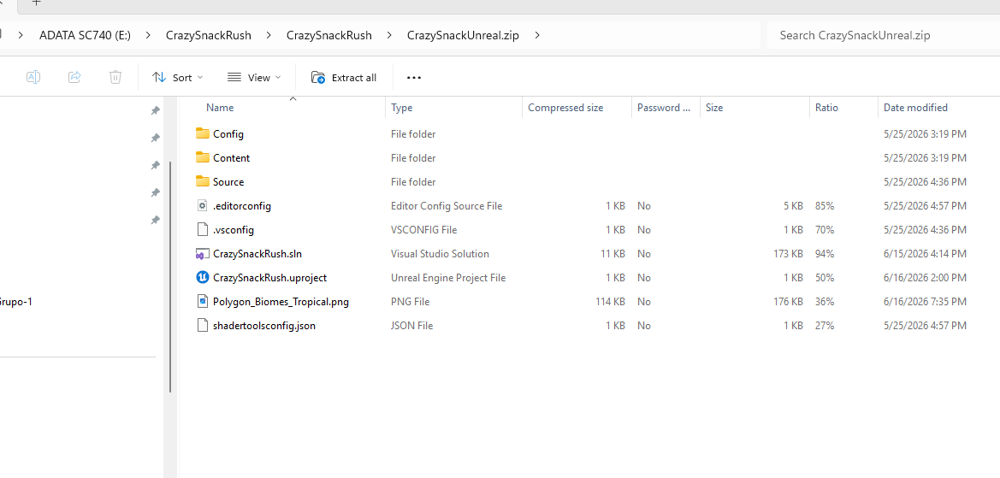

# CrazySnackRush

CrazySnackRush es un proyecto inspirado en las dinamicas de Overcooked 2, pero llevado a una version mucho mas simplificada.

## Requisitos

- Unreal Engine 5.7 para abrir, compilar y ejecutar el cliente.
- Python para correr el server de juego.

## Server en Python

Para ejecutar el server en Python usa este comando:

```cmd
python -m uvicorn main:app --host 127.0.0.1 --port 8000
```

## Cliente en Unreal

El archivo `CrazySnackUnreal.zip` que se puede descarcar desde https://drive.google.com/file/d/1ZL2G0YXlmh6zF2X7clXOMIrG0HZ7eHCA/view?usp=sharing contiene el codigo fuente del cliente hecho en Unreal.

Contenido principal del zip:

- `Config/`: configuraciones del proyecto de Unreal.
- `Content/`: assets del proyecto, como mapas, blueprints, materiales, widgets y otros recursos del cliente.
- `Source/`: codigo fuente en C++ del proyecto.
- `CrazySnackRush.uproject`: archivo principal del proyecto de Unreal.
- `CrazySnackRush.sln`: solucion de Visual Studio para compilar el cliente.
- `.editorconfig`, `.vsconfig` y `shadertoolsconfig.json`: archivos auxiliares de configuracion del entorno.

Referencia visual del contenido del zip:


